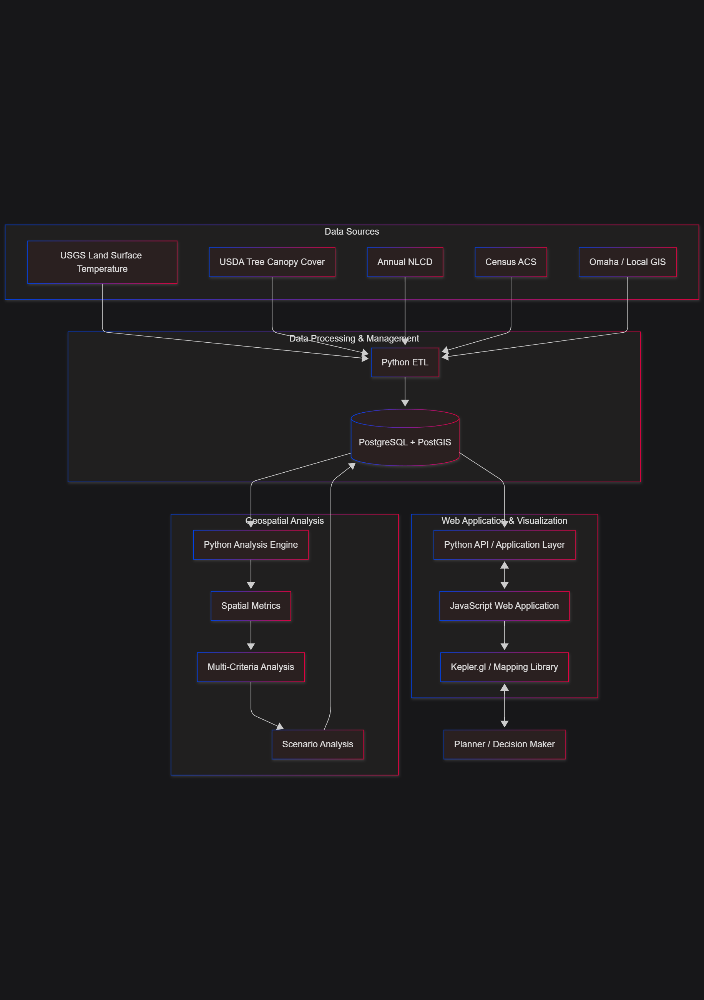

# Urban Heat Mitigation Decision-Support Toolkit for Omaha

**David Vanosdall**
https://github.com/dvanosdall/GEOG_778
**GEOG 778, Fall 2026**

## Table of Contents

1. [Problem Statement and Purpose](#1-problem-statement-and-purpose)
2. [Intended Audience](#2-intended-audience)
3. [Data Sources and Availability](#3-data-sources-and-availability)
4. [Proposed Final Product](#4-proposed-final-product)
5. [Web Application and User Interaction](#5-web-application-and-user-interaction)
   - [Interactive Mapping](#interactive-mapping)
   - [Spatial Querying](#spatial-querying)
   - [Criteria Inspection](#criteria-inspection)
   - [Scenario Analysis](#scenario-analysis)
   - [Scenario Comparison](#scenario-comparison)
   - [Summary Statistics and Charts](#summary-statistics-and-charts)
   - [Results Export](#results-export)
6. [GIS&T Body of Knowledge](#6-gist-body-of-knowledge)
7. [Technical Skills and Methods](#7-technical-skills-and-methods)
   - [Python Programming](#python-programming)
   - [Raster and Vector Processing](#raster-and-vector-processing)
   - [Spatial Database Development](#spatial-database-development)
   - [Multi Criteria Decision Analysis](#multi-criteria-decision-analysis)
   - [Scenario and Sensitivity Analysis](#scenario-and-sensitivity-analysis)
   - [JavaScript Application Development](#javascript-application-development)
   - [Version Control and Reproducibility](#version-control-and-reproducibility)
8. [System Architecture](#8-system-architecture)
9. [Project Feasibility and Scope](#9-project-feasibility-and-scope)
10. [Expected Outcomes](#10-expected-outcomes)
11. [References](#11-references)

## 1. Problem Statement and Purpose

Urban heat is an important place based problem in Omaha, Nebraska.  Land surface temperature, tree canopy, impervious surfaces, land cover, and population distribution vary across the city and contribute to differences in heat exposure and the potential effectiveness of different mitigation strategies.  Omaha has also identified climate resilience, greenspace, and tree canopy as important areas for planning and investment.

The challenge is not simply determining where urban heat occurs.  Multiple datasets are available that describe heat, vegetation, land cover, population, and the built environment, but these datasets do not by themselves identify where specific heat mitigation strategies may provide the greatest potential benefit.  Translating broad planning goals into geographically specific priorities requires the integration and analysis of multiple spatial datasets.

This project will develop a **GIS based urban heat mitigation decision support toolkit for Omaha**.  The system will integrate environmental, demographic, land cover, and local geographic information to identify areas where different heat mitigation strategies may be appropriate.

The project will move beyond producing a single urban heat map or a simple tree planting priority map.  Instead, the system will evaluate multiple criteria and allow users to examine how different planning priorities affect the resulting areas of concern.

The system will be designed to help answer three primary questions:

1. **Why is an area a priority?**
2. **What type of intervention may be appropriate?**
3. **How do identified priorities change when different planning criteria are emphasized?**

The resulting toolkit is intended to function as a decision support resource rather than a system that produces definitive engineering or planning recommendations.

[Back to Table of Contents](#table-of-contents)

## 2. Intended Audience

The primary audience for the project is organizations and personnel involved in urban planning, forestry, sustainability, and climate resilience in Omaha.

Potential users include:

- Municipal planners
- Urban forestry staff
- Sustainability and climate resilience personnel
- Organizations involved in heat mitigation planning and investment
- GIS professionals supporting municipal planning activities

The toolkit may also provide value to researchers and other GIS professionals interested in evaluating urban heat mitigation strategies.

The intended users are important to the project design because the system is intended to support geographic decision making rather than simply present analytical results.  Users should be able to understand why an area has been identified as a priority, examine the criteria contributing to that priority, and compare results produced under different planning assumptions.

[Back to Table of Contents](#table-of-contents)

## 3. Data Sources and Availability

The project will use established public geospatial datasets that can be obtained through government and public data sources.  The availability of these datasets makes the project feasible within the timeframe of the course and provides an opportunity to develop a reproducible data processing workflow.

The primary datasets are expected to include:

| Dataset | Intended Use |
|---|---|
| **USGS Landsat derived Land Surface Temperature** | Measure land surface temperature and identify areas with elevated surface heat |
| **USDA Forest Service Tree Canopy Cover** | Measure existing tree canopy and identify areas with limited canopy |
| **MRLC Annual NLCD** | Describe land cover, impervious surfaces, and characteristics of the built environment |
| **U.S. Census American Community Survey** | Provide population and demographic information for evaluating potential heat exposure |
| **Omaha and Local GIS Data** | Provide roads, schools, parks, public facilities, and other local geographic context |

The primary analysis will use a recent common data year where practical.  Historical datasets may also be incorporated as an optional component to evaluate changes over time or provide additional context.

The data processing workflow will be designed to standardize the datasets before analysis.  This will include tasks such as coordinate reference system management, spatial alignment, data cleaning, raster processing, vector processing, attribute standardization, and conversion of source data into analytical variables.

Python will be used to automate much of this process.  The processed datasets and derived analytical information will be stored in PostgreSQL with PostGIS so that the workflow can be repeated when data are updated or analytical criteria change.

The initial investigation indicates that the primary datasets are available from established public sources.  Local datasets will be evaluated during the implementation phase based on their availability, geographic coverage, licensing, and relevance to the proposed interventions.

[Back to Table of Contents](#table-of-contents)

## 4. Proposed Final Product

The final product will be a **GIS based urban heat mitigation decision support toolkit** consisting of a geospatial analysis workflow, spatial database, and interactive web application.

The Python component will provide the primary data processing and analytical functionality.  Expected Python libraries include GeoPandas for vector processing, Rasterio for raster processing, Shapely for geometry operations, NumPy and Pandas for numerical and tabular processing, PyProj for coordinate system operations, and SQLAlchemy or GeoAlchemy2 for interaction with PostgreSQL and PostGIS.

The analytical workflow will generally follow this structure:

> **Data acquisition → data processing → spatial metrics → normalized criteria → multi criteria analysis → scenario analysis → results → interactive visualization**

The analysis will generate spatial indicators representing factors such as:

- Heat intensity
- Tree canopy coverage or canopy deficit
- Impervious surface characteristics
- Population exposure
- Land cover
- Site characteristics and intervention constraints

These indicators will be normalized so that different types of spatial information can be evaluated together.  A configurable weighting system will then allow criteria to be emphasized differently depending on the planning scenario.

For example, one scenario could place greater emphasis on heat intensity and population exposure, while another could place greater emphasis on canopy deficits and the availability of potential planting areas.

The system may identify different potential intervention categories based on the combination of conditions present in an area.  Potential categories include tree canopy, cool surface strategies, and shade interventions.  The exact intervention categories and criteria will be refined during implementation based on data availability and project scope.

The final product will therefore be more than a static map.  It will provide a reusable workflow for processing data, performing spatial analysis, evaluating scenarios, and communicating results.

[Back to Table of Contents](#table-of-contents)

## 5. Web Application and User Interaction

The project will include an interactive web based visualization component.  JavaScript will provide the application interface and will connect the analytical results to an interactive mapping environment.

Kepler.gl (is a library I want to work with since it was recommended to me) or a similar geospatial visualization library will be evaluated for displaying the resulting spatial data.  The exact JavaScript framework and application architecture will be determined during implementation.

The web application is expected to provide users with several forms of interaction.

### Interactive Mapping

Users will be able to explore spatial patterns of heat, canopy, impervious surfaces, population exposure, and other analytical criteria through an interactive map.

### Spatial Querying

Users will be able to select or inspect geographic areas and examine the underlying analytical information contributing to their priority score.

### Criteria Inspection

The application will provide information about the individual criteria contributing to an area's result.  This will allow users to distinguish between an area receiving a high priority because of elevated heat, limited canopy, population exposure, or a combination of factors.

### Scenario Analysis

Users will be able to modify criteria weights and evaluate alternative planning scenarios.  The system will then generate results based on the selected weighting scheme.

### Scenario Comparison

The application will allow users to compare results between different scenarios.  This will help demonstrate how sensitive identified priorities are to changes in planning assumptions.

### Summary Statistics and Charts

Where appropriate, the application will provide summary statistics or charts describing the areas identified under different scenarios.

### Results Export

Analytical results may be made available for export so that users can continue working with the results in other GIS software.

These interactions are intended to make the application useful for decision support rather than simply presenting a completed analytical map.

[Back to Table of Contents](#table-of-contents)

## 6. GIS&T Body of Knowledge

The project draws on multiple knowledge areas identified in the UCGIS Geographic Information Science & Technology Body of Knowledge.  The most directly applicable areas are **Analytics and Modeling (AM), Data Management (DM), Cartography and Visualization (CV), Programming and Development (PD), and Domain Applications (DA)**.

**Analytics and Modeling (AM)** is applied through spatial analysis and the development of metrics to evaluate relationships between urban heat, land cover, tree canopy, population, and other geographic factors.  The project will combine these factors to identify areas where additional vegetation or other mitigation strategies may have the greatest potential to reduce heat exposure.  The analytical framework can also be used to compare different assumptions and potential intervention scenarios.

**Data Management (DM)** is applied through the integration, organization, and management of raster and vector datasets within PostgreSQL/PostGIS.  The database will provide a centralized structure for source datasets, derived analytical layers, criteria, and results while supporting the repeatable processing of the project's geographic data.

**Cartography and Visualization (CV)** is applied through interactive web mapping and visual communication of urban heat conditions, contributing factors, and potential mitigation priorities.  The application will allow users to explore spatial patterns and understand how different geographic factors contribute to areas of elevated heat exposure.

**Programming and Development (PD)** is applied through Python-based data processing and analysis, automated workflows, database interaction, and JavaScript-based web application development.  Programming will support a reproducible workflow in which datasets can be processed consistently and analytical criteria can be adjusted as needed.

**Domain Applications (DA)** connects these GIS&T methods to the specific application domain of urban heat mitigation and planning in Omaha.  The project applies geographic information technologies to a practical planning problem involving heat exposure, vegetation, land cover, population, and potential mitigation strategies.

Together, these knowledge areas demonstrate that the project requires more than a single GIS technique.  It combines spatial analysis, data management, cartographic visualization, programming, and domain-specific application to develop a decision-support system for evaluating urban heat mitigation opportunities in Omaha.

[Back to Table of Contents](#table-of-contents)

## 7. Technical Skills and Methods

The project will apply technical skills across several areas of GIS and software development.

### Python Programming

Python will be used to automate data acquisition, preprocessing, transformation, spatial analysis, and generation of analytical results.

Potential libraries include:

- GeoPandas
- Rasterio
- Shapely
- NumPy
- Pandas
- PyProj
- SciPy where appropriate
- SQLAlchemy and GeoAlchemy2 for database interaction or Django

### Raster and Vector Processing

Raster and vector datasets will be processed and standardized before being combined in the analytical workflow.  This will require managing spatial resolution, coordinate systems, geographic extent, and data formats.

### Spatial Database Development

PostgreSQL and PostGIS will be used to create a structured spatial database.  The database will contain source data where appropriate, derived analytical layers, criteria, and scenario results.

### Multi Criteria Decision Analysis

The project will use a multi criteria decision analysis approach to combine normalized spatial indicators.  Criteria will be assigned configurable weights to produce priority scores under different scenarios.

### Scenario and Sensitivity Analysis

Scenario analysis will allow different weighting schemes or planning assumptions to be evaluated.  This will provide a method for examining how changes in criteria affect the areas identified as priorities.

### JavaScript Application Development

JavaScript will be used to create the interactive application and manage communication between the user interface, application layer, and mapping component.

### Version Control and Reproducibility

Git and GitHub will be used to maintain source code, documentation, and project history.  The Python environment and dependencies will also be documented so that the analytical workflow can be reproduced.

[Back to Table of Contents](#table-of-contents)

## 8. System Architecture

The proposed architecture separates data processing, spatial analysis, data management, application services, and visualization into distinct components.

The major components are:

1. **Data Sources**
2. **Python ETL**
3. **PostgreSQL and PostGIS**
4. **Python Analysis Engine**
5. **Spatial Metrics**
6. **Multi Criteria Analysis**
7. **Scenario Analysis**
8. **Python API and Application Layer**
9. **JavaScript Web Application**
10. **Kepler.gl or similar mapping library**
11. **Planner or Decision Maker**

The general data flow is:

> **Data Sources → Python ETL → PostgreSQL/PostGIS → Python Analysis Engine → Spatial Metrics → Multi Criteria Analysis → Scenario Analysis → Application Layer → JavaScript Web Application → Interactive Map**

Figure 1. Proposed system architecture. The system uses Python to acquire and process geospatial data, PostgreSQL/PostGIS to manage spatial data, and a Python-based analysis workflow to calculate spatial metrics and perform multi-criteria and scenario analysis. Results are provided to a JavaScript web application and displayed through an interactive mapping library. Users can modify criteria and scenarios and examine how those choices affect identified mitigation priorities.

The application will also support interaction in the opposite direction.  User selections and scenario settings can be passed from the JavaScript application through the application layer to the analytical and database components, allowing updated results to be returned to the map.

This modular structure is intended to separate the analytical workflow from the presentation layer.  As a result, analytical processing can be rerun with updated datasets or criteria without requiring the entire visualization system to be rebuilt.

The architecture may be refined during implementation as specific technologies and application requirements are established.

[Back to Table of Contents](#table-of-contents)

## 9. Project Feasibility and Scope

The project is considered feasible because the primary datasets are available from established public sources and the proposed technologies are based on tools commonly used for geospatial data processing, spatial databases, and web mapping.

The project will be developed incrementally.  The initial implementation will focus on establishing the data pipeline, spatial database, analytical criteria, and core priority analysis.  The interactive application will then be developed around the completed analytical workflow.

The project scope will be managed by treating some capabilities as optional rather than required for the minimum viable final product.

The core project will focus on:

- A defined Omaha study area
- Publicly available environmental and demographic datasets
- Automated Python data processing
- PostgreSQL and PostGIS data management
- Spatial metrics
- Multi criteria scoring
- At least one intervention priority analysis
- Interactive web based visualization
- Documentation of the analytical workflow

More advanced capabilities, such as extensive historical analysis, numerous intervention categories, advanced sensitivity analysis, or deployment as a fully packaged application, may be implemented if time permits.

This approach allows the project to maintain a functional and meaningful final product while providing opportunities to expand the system during development.

[Back to Table of Contents](#table-of-contents)

## 10. Expected Outcomes

The expected outcome is a working prototype of a configurable geospatial decision support toolkit for evaluating urban heat mitigation opportunities in Omaha.

The project should demonstrate the ability to:

1. Acquire and integrate multiple public geospatial datasets.
2. Process raster and vector data using Python.
3. Store and manage spatial information using PostgreSQL and PostGIS.
4. Calculate spatial indicators related to urban heat and potential mitigation.
5. Combine multiple criteria using a multi criteria decision analysis approach.
6. Evaluate alternative planning scenarios.
7. Present analytical results through an interactive web application.
8. Communicate the factors contributing to identified priorities.
9. Produce a reproducible workflow that can be updated with new data or analytical assumptions.

The final system will provide a practical example of how GIS can be used to move from identifying a geographic problem toward evaluating potential responses.

Rather than treating the resulting priority areas as definitive recommendations, the project will demonstrate how spatial analysis can organize multiple sources of information into a configurable decision support process.

[Back to Table of Contents](#table-of-contents)

## 11. References

Initial project development will rely primarily on publicly available datasets and documentation from federal, state, local, and other authoritative sources.  Specific dataset citations and technical documentation will be added as the final data inventory is established.

Primary data sources expected to be referenced include:

- U.S. Geological Survey, Landsat derived Land Surface Temperature
- USDA Forest Service, Tree Canopy Cover
- Multi Resolution Land Characteristics Consortium, Annual National Land Cover Database
- U.S. Census Bureau, American Community Survey
- City of Omaha and other applicable local GIS data sources

Additional academic literature concerning urban heat, tree canopy, heat mitigation, multi criteria decision analysis, and urban climate resilience will be incorporated during the implementation and research phases of the project.

GitHub Repository
Vanosdall, D. (2026). GEOG_778: Urban heat mitigation decision-support toolkit for Omaha [Computer software]. GitHub. https://github.com/dvanosdall/GEOG_778

Additional AI tools that were leveraged for quick formatting or quick scripting assistance
GitHub. (2026). GitHub Copilot [AI coding assistant]. GitHub. https://github.com/features/copilot

[Back to Table of Contents](#table-of-contents)